Passo a passo para configurar ambiente wordpress com docker swarm
=================================================================

Pré requisitos:
---------------

1.  Tenha docker instalado em sua máquina. Caso não tenha acesse [Install Docker Engine](https://docs.docker.com/engine/install/)
    
2.  Tenha docker-compose instalado em sua máquina. Caso não tenha acesse [Install Docker Compose](https://docs.docker.com/compose/install/)
    
3.  Tenha git instalado em sua máquina. Caso não tenha acesse [Install git](https://git-scm.com/downloads)
    
4.  Verifique que as portas a seguir não estejam sendo utilizadas por outros aplicativos de sua máquina:
    
    *   9104
    *   6379
    *   8080
    *   9090
    *   3000
    *   8081

* * *

Passo 1: clonar repositório.
----------------------------

1.  Inicie um terminal partindo da àrea de trabalho(~).
    
        git clone https://github.com/DanielHHartmann/WpWebConfigDockerSwarm.git
        cd WpWebConfigDockerSwarm

* * *

Passo 2: Iniciar Docker Swarm
---------------------------

1.  No terminal insira os comandos:
    
        docker swarm init
        docker stack deploy -c docker-compose.yml "wpswarm"
    
Espere todos os serviços iniciarem, saberá que iniciaram quando aparecer todos os seguintes:
        
        Creating network wpswarm_my_network
        Creating service wpswarm_prometheus
        Creating service wpswarm_grafana
        Creating service wpswarm_cadvisor
        Creating service wpswarm_db
        Creating service wpswarm_mysql-exporter
        Creating service wpswarm_redis
        Creating service wpswarm_wordpress

Passo 3: Configurar WordPress
-------------------------------

1.  Em um navegador, acesse [http://localhost:8080](http://localhost:8080)

2.  Você está na tela de configuração inical do WordPress, agora siga as instruções que o próprio site lhe informa.

3.  Quando você chegar nessa tela significa que terminou a configuração incial: 
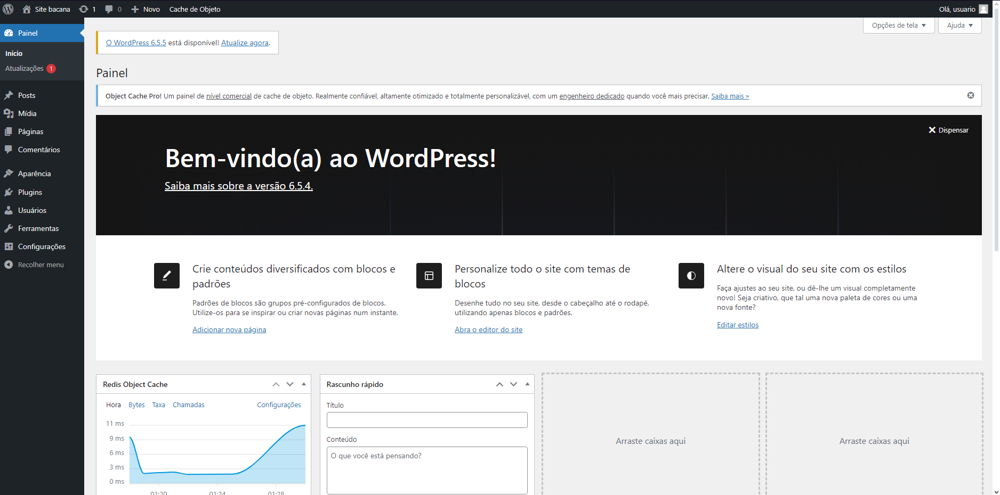
4.  Clique em Plugins: 

5.  Clique em Adicionar Plugin:
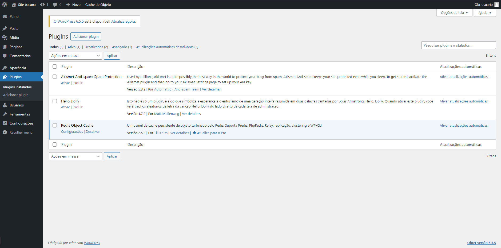
6.  Pesquise pelo plugin do redis: `Redis Object Cache` 
.
7.  Clique em Instalar e espere a instalação: 
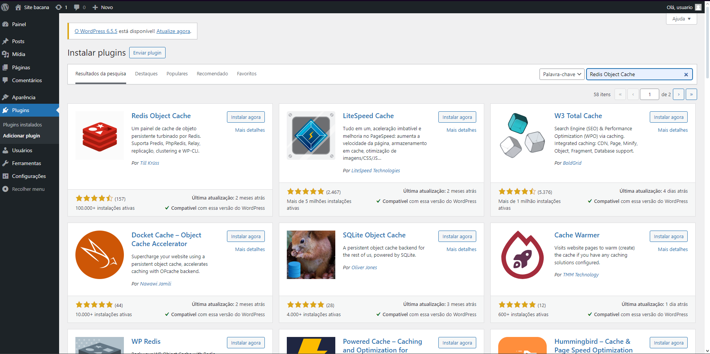
8.  Clique em ativar: 
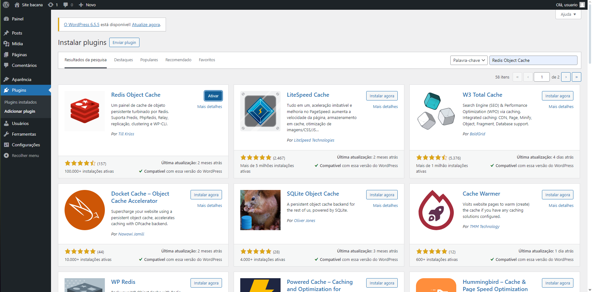
9.  Você deve ter sido levado para a página do plugin Redis Object Cache, e devido ao container do Wordpress não aceitar variaveis de ambiente o redis não está definido em suas configurações. Devido a isso, provavelmente o redis estará inacessível: 
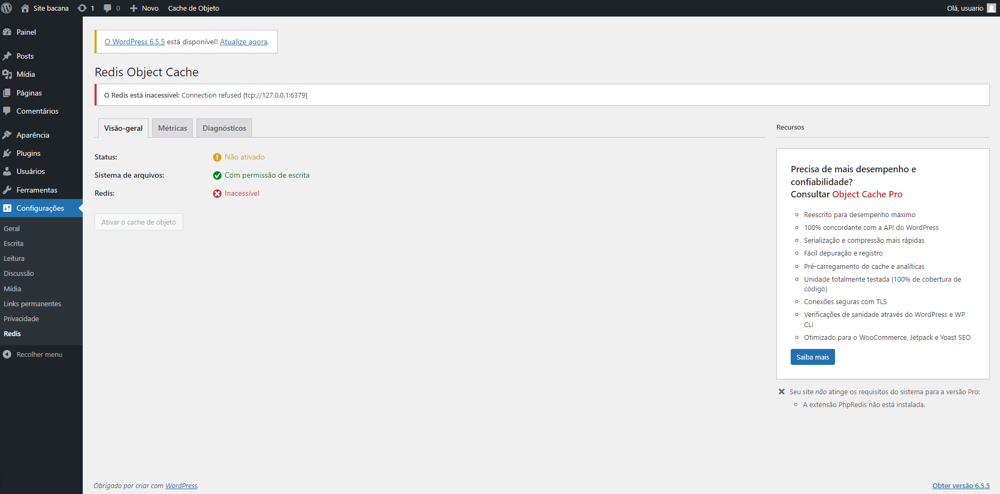

Passo 4: Definir o Redis na váriavel de ambiente do WordPress e ativar Redis
-------------------------------------------------

1.  Volte para o terminal e insira os comandos:

        sudo docker ps
        
2. Você ver uma lista de container ache o container do wordpress e copie seu id e no próximo comando cole no lugar de "SEUID";

        sudo docker exec -it SEUID bash
    
Você deve estar dentro do container agora.
    
3.  Realize os comandos:
    
        apt update
        apt install nano
        nano wp-config.php
    
Você deve estar dentro de um arquivo agora.

5.  Use a setinha para baixo até achar a linha `/* That's all, stop editing! Happy publishing. */`, uma linha antes dela cole a seguinte linha:
    
        define('WP_CACHE', true);define('WP_REDIS_HOST', 'redis');define('WP_REDIS_PORT', 6379);
    
6.  Aperte "Ctrl + X", depois "y", depois "enter"
7.  Volte para o site e atualize a página, o Redis agora está como Acessível é so clicar em "Ativar Cache do Objeto: 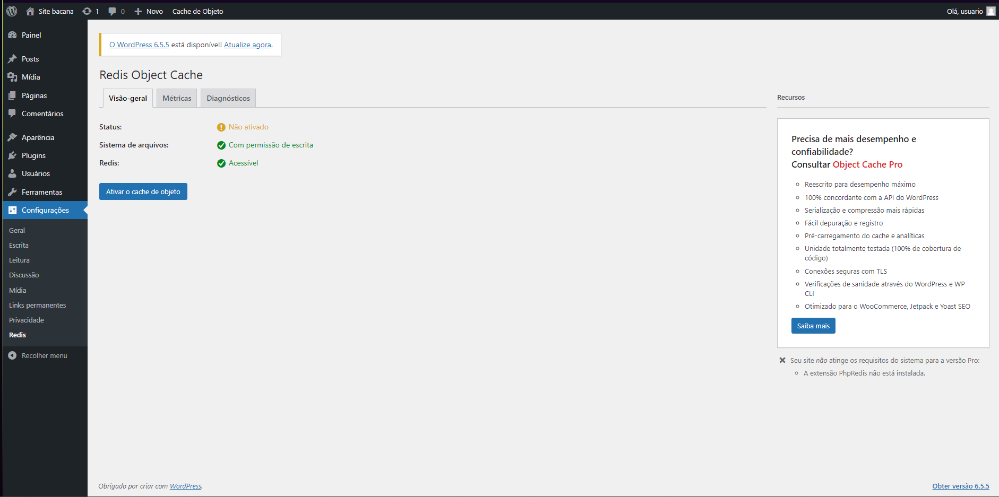

Pronto agora seu Wordpress já esta com as configurações necessárias, falta ainda acessar o Prometheus

Passo 5: Acessar o Prometheus
-----------------------------

1.  Agora, acesse o link: [http://localhost:9090](http://localhost:9090).

2.  Aqui, você pode verificar diversas métricas, ao clicar em "add panel" depois no simbolo de planeta um modal com diversas métricas diferentes aparecerá, quais você pode selecionar, como por exemplo as de container, digitando container e selecionando alguma que comece com "container" ou de mysql pesquisando "mysql" e selecionando uma delas:
    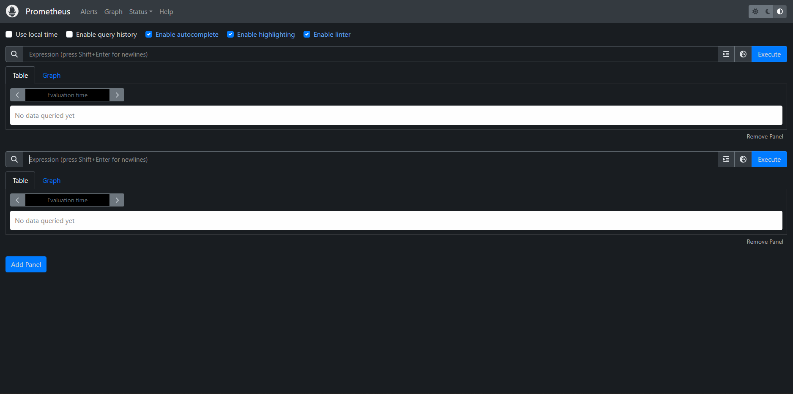
    
    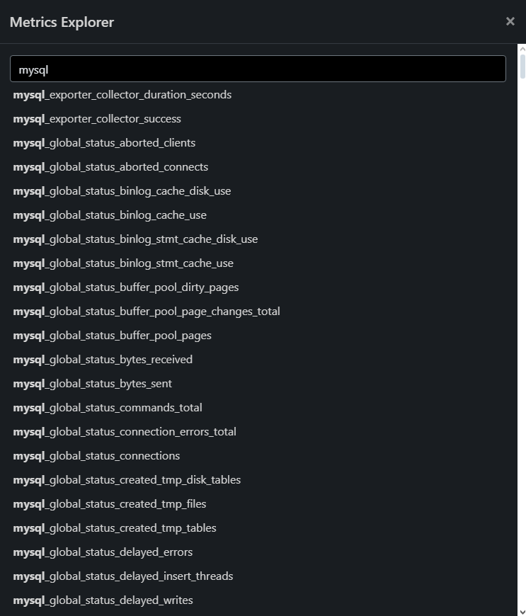
    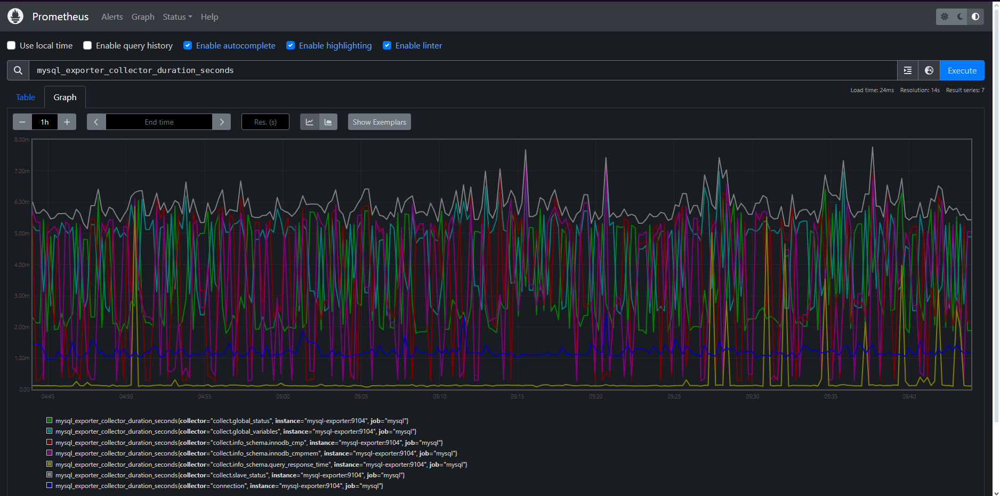

Passo 6: Configurando o grafana(Dashboard) com Prometheus
-----------------------------

1.  Acesse a pagina: [http://localhost:3000](http://localhost:3000).

2.  Para logar no sistema use o usuario "admin" e senha "admin". E depois insira uma nova senha.

3.  Agora na tela home clique em "Add New Connection", pesquise por Prometheus. 
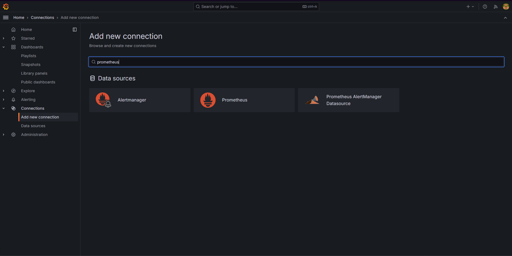
4.  Clique em "Add new data source". 

5.  Em Connection adicione a url do servidor do prometheus: `http://prometheus:9090`. 
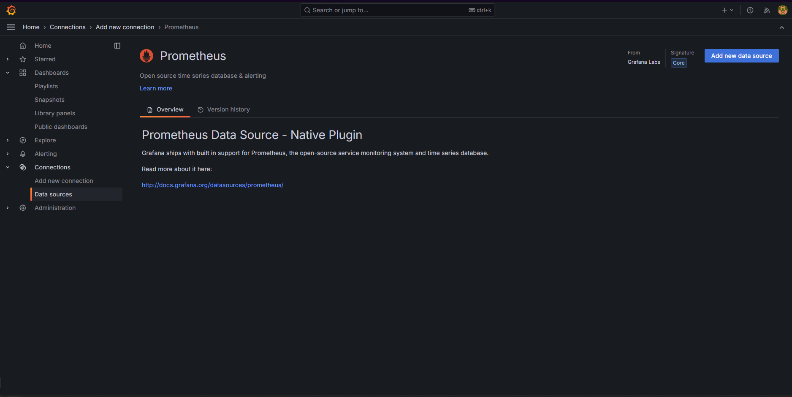
7.  Na dashboards do grafana clique em "Create Dashboard", depois em "Add visualization" e selecione Prometheus.
9.  Na opção Query, selecione uma métrica do Prometheus, depois em "Run queries" então em "Apply". 
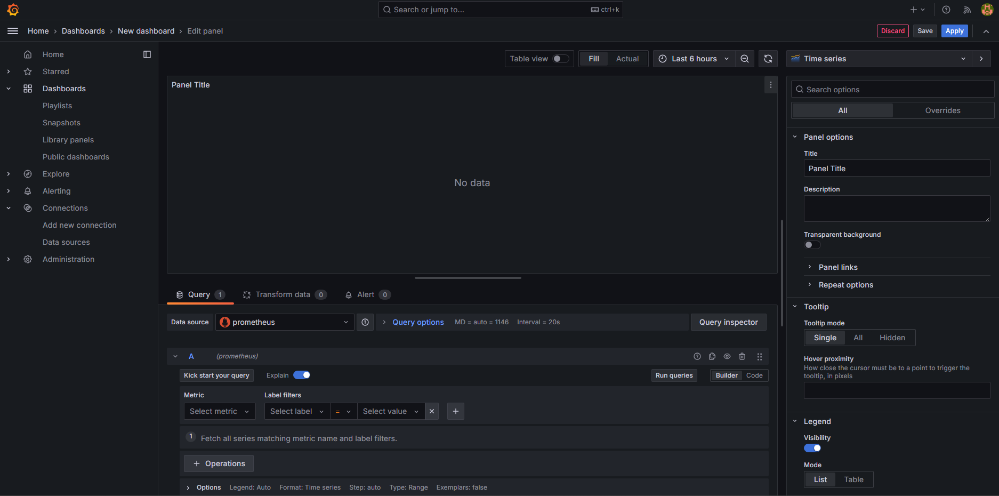
10. Agora você tem um gráfico do Prometheus no seu Dashboard 

Passo 7: Monitoramento do docker
-----------------------------

1. Como visto acima o prometheus já vem com as métricas de containeres, isso porque uma de suas dependêcias, o cadvisor. Ele por sí só já tem um acesso atráves do link  [http://localhost:8081](http://localhost:8081). Aqui você tem acesso a diferentes métricas referentes ao containeres:

